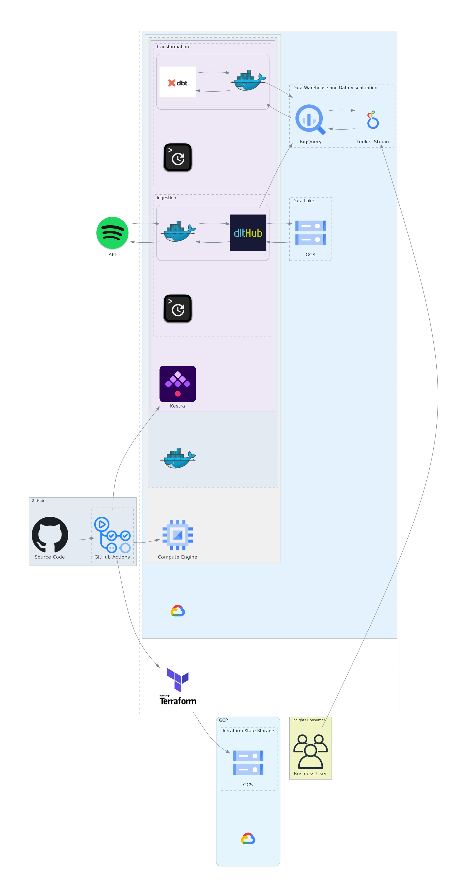

# Proyecto de Data Engineering con la API de Spotify

[](https://github.com/jesusoviedo/spotify-dwh-insights/actions/workflows/ci-cd-terraform.yml)
[](https://github.com/jesusoviedo/spotify-dwh-insights/actions/workflows/ci-cd-deploy-instance.yml)
[](https://github.com/jesusoviedo/spotify-dwh-insights/actions/workflows/ci-cd-deploy-flows.yml)

[](https://github.com/jesusoviedo/spotify-dwh-insights/actions/workflows/ci-cd-build-deploy-docker-image.yml)
[](https://github.com/jesusoviedo/spotify-dwh-insights/actions/workflows/ci-sec-secrets-scan.yml)
[](https://github.com/jesusoviedo/spotify-dwh-insights/actions/workflows/ci-qa-pre-commit.yml)

[](https://github.com/pre-commit/pre-commit)

Este proyecto de Data Engineering tiene como objetivo extraer información de la API de Spotify sobre los lanzamientos recientes de álbumes, obtener detalles de sus pistas y los datos de los artistas involucrados. 

Luego, estos datos serán almacenados en un Data Lake, procesados para un Data Warehouse y utilizados en un dashboard con visualizaciones clave.


## 🎯 Objetivos
**1. Extracción de datos:** obtener información de álbumes, pistas y artistas desde la API de Spotify.

**2. Almacenamiento en Data Lake:** guardar los datos sin procesar en Google Cloud Storage (GCS).

**3. Procesamiento y transformación:**
- Usar DLT para ingerir datos de manera eficiente.
- Aplicar dbt en BigQuery para modelar los datos.

**4. Creación de visualizaciones:** construir un dashboard con dos gráficos relevantes (a definir) utilizando Looker Studio como herramienta de visualización.

**5. Infraestructura como código:** utilizar Terraform para desplegar recursos en GCP.

**6.Automatización del pipeline:** orquestar el flujo de datos con Kestra y automatizar despliegues con GitHub Actions.


## 🏛️ Arquitectura



1. Ingesta de datos
    - Se extraen los datos desde la API de Spotify usando DLT.
    - Los datos se almacenan en GCS como archivos Parquet.

2. Procesamiento y modelado
    - Se trasladan los datos desde GCS a BigQuery.
    - Se aplican transformaciones y modelos con dbt.

3. Visualización
    - Se usa Looker Studio como herramienta de BI para crear un Dashboard interativo con dos páginas.


## 🛠️ Tecnologías utilizadas
- **Python:** Lenguaje principal para construir el pipeline.
- **Docker:** Contenerización del pipeline para facilitar la portabilidad y consistencia.
- **Docker Hub:** Almacenamiento y distribución de las imágenes del pipeline.
- **Kestra:** Orquestación del pipeline de datos.
- **DLT:** Extracción e ingestión de datos.
- **Google Cloud Storage (GCS):** Almacenamiento del Data Lake.
- **BigQuery:** Data Warehouse.
- **DBT:** Modelado de datos.
- **Looker Studio:** Visualización de datos.
- **Terraform:** Infraestructura como código en GCP.
- **GitHub Actions:** CI/CD para despliegue en producción.

## 📂 Estructura de carpetas
```bash
📂 spotify-data-engineering  
│── 📄 .github/workflows        # Configuración de GitHub Actions 
│── 📂 data/                    # Archivos de datos de ejemplo 
│── 📂 dbt/                     # Modelos de transformación para BigQuery  
│── 📂 dlt/                     # Configuración y scripts de DLT 
│── 📂 docs/                    # Documentación adicional y archivos README auxiliares
│── 📂 kestra/                  # Flujos de trabajo en Kestra  
│── 📂 scripts/                 # Scripts auxiliares  
│── 📂 terraform/               # Definiciones de infraestructura en GCP  
│── 📂 visualizations/          # Dashboards y reportes  
│── 📄 .gitignore               # Archivos a excluir del repositorio
│── 📄 .pre-commit-config.yaml  # Configuración de pre-commit para hooks y linters
│── 📄 README.md                # Documentación del proyecto  
│── 📄 LICENSE                  # Información sobre la licencia del proyecto 
```


## ☁️ Configuración previa en GCP
Antes de ejecutar este proyecto de manera local o desplegarlo en GCP, es necesario configurar correctamente el entorno en Google Cloud Platform (GCP). Esto incluye:

1. Crear un proyecto en GCP
2. Configurar cuentas de servicio con los permisos adecuados:
- Una cuenta de servicio para gestionar el almacenamiento en Google Cloud Storage (GCS).
- Una cuenta de servicio para administrar datasets y tablas en BigQuery.
- Una cuenta de servicio para desplegar instancias en Compute Engine (opcional, si se usará Docker en GCE).

Para una guía detallada sobre estos pasos, consulta el archivo [`setup_gcp_project`](./docs/setup_gcp_project.md).


## ⚙️ Configuración del entorno local


### 🐍 Entorno de Python con Pipenv
Para gestionar el entorno de Python en este proyecto, se utiliza Pipenv, que permite crear un entorno virtual, instalar dependencias y ejecutar código de manera aislada.

No todas las carpetas del proyecto requieren un entorno virtual. En aquellas donde sea necesario, se incluirán los pasos específicos para configurarlo con Pipenv.

A continuación, se resumen los pasos básicos:
- Instalación de Pipenv
- Creación del entorno e instalación de dependencias
- Activación del entorno virtual
- Ejecución de código dentro del entorno

Para ver los detalles y comandos específicos, consulta el archivo [`python_env_setup.md`](./docs/python_env_setup.md).


### 🐳 Docker y Docker Compose
Este proyecto requiere Docker y Docker Compose para ejecutarse de manera local. Estas herramientas permiten contenerizar los servicios, garantizando un entorno reproducible e independiente del sistema operativo.

Si necesitas una referencia rápida sobre Docker, consulta el archivo [`docker_basics.md`](./docs/docker_basics.md), donde encontrarás información sobre la instalación, gestión de contenedores e imágenes.


### 🌍 Terraform
Este proyecto requiere Terraform instalado para poder gestionar y desplegar la infraestructura en la nube de manera local. Terraform permite crear, actualizar y administrar los recursos de infraestructura de forma eficiente y reproducible.

Si necesitas una referencia rápida sobre cómo instalar y utilizar Terraform, consulta el archivo [`terraform_basics.md`](./docs/terraform_basics.md), donde encontrarás información sobre la instalación, configuración y comandos básicos de Terraform.


## 📂 Organización del Proyecto
A continuación, se describe el contenido de cada carpeta principal dentro del proyecto para facilitar su comprensión y uso.


### 📊 Entendiendo los Datos ([`data/`](./data))
Esta carpeta contiene archivos de datos de ejemplo utilizados para pruebas y informacion del servicio de Spotify. Aquí se incluyen respuestas de la API de Spotify en formato JSON, que sirven como referencia para entender la estructura de los datos obtenidos.

⚠️ Uso de los datos: este proyecto no almacena datos de manera permanente. Los archivos en esta carpeta son solo ejemplos de respuestas de la API de Spotify y no contienen datos en tiempo real. Para más información sobre las restricciones de uso de los datos y los servicios de Spotify, consulta el archivo `data/README.md`.


### 📚 Documentación Auxiliar ([`docs/`](./docs))
Esta carpeta contiene guías rápidas y documentación de referencia para configurar y entender herramientas clave utilizadas en el proyecto.


### 🛠 Scripts Auxiliares ([`scripts/`](./scripts))
Aquí se encuentran scripts en Python diseñados para facilitar la automatización de diversas tareas dentro del proyecto. Estos pueden incluir herramientas de soporte, pruebas y procesos adicionales relacionados con la gestión de datos.


### ☁️ Infraestructura como Código ([`terraform/`](./terraform))
Esta carpeta contiene las configuraciones de Terraform necesarias para desplegar y gestionar los recursos en Google Cloud Platform (GCP). Aquí se definen los servicios en la nube de forma eficiente, reproducible y automatizada.


### 🚀 Extracción e Ingesta con DLT ([`dlt/`](./dlt))
Esta carpeta contiene la configuración y los scripts necesarios para extraer datos desde la API de Spotify y cargarlos en el Data Lake de GCS.


### 🔄 Orquestación con Kestra ([`kestra/`](./kestra))
En esta carpeta se encuentran los flujos de trabajo definidos en Kestra. Aquí se configura la ejecución automatizada del pipeline, incluyendo la extracción, transformación y carga de datos.


### 🏗 Modelado de Datos con DBT ([`dbt/`](./dbt))
Aquí se encuentran los modelos de transformación creados con dbt para estructurar los datos almacenados en BigQuery. Contiene definiciones de modelos, fuentes de datos, pruebas y documentación generada automáticamente.


### 📈 Visualización de Datos con Looker Studio ([`visualizations/`](./visualizations))
Esta carpeta contiene los recursos relacionados con la creación de dashboards interactivos en Looker Studio. Incluye configuraciones y documentación del reporte desarrollado, el cual se actualiza automáticamente cada 12 horas o bajo demanda. Actualmente, el dashboard cuenta con dos páginas que ofrecen insights visuales a partir de los datos procesados, permitiendo explorar métricas clave.


### 🔄 Integración y Despliegue Automático ([`.github/workflows/`](./.github/workflows)`)
En esta carpeta se almacena la configuración de GitHub Actions para implementar un flujo de CI/CD robusto. Asegura que cada cambio en el código pase por validaciones antes de ser desplegado, permitiendo una entrega continua y segura.

## 🧹 Code Quality

Este proyecto utiliza [pre-commit](https://pre-commit.com/) para ejecutar linters y herramientas de formato de código antes de realizar un commit. Puedes obtener más detalles sobre cómo configurar y usar estas herramientas en el archivo [code_quality.md](./docs/code_quality.md).

## 🤝 Contribuciones
Las contribuciones son bienvenidas. Si tienes alguna idea o mejora, no dudes en hacer un fork del repositorio y enviar un pull request. Toda ayuda es apreciada para mejorar el proyecto.


## 📜 Licencia
[](https://opensource.org/licenses/MIT)

Este proyecto está licenciado bajo la Licencia MIT. Para más detalles, consulta el archivo [`LICENSE`](./LICENSE).


## 📬 Contacto
Para cualquier pregunta, sugerencia o problema relacionado con el proyecto, puedes ponerte en contacto con el desarrollador principal a través de su perfil de LinkedIn:

- **Jesús Oviedo Riquelme**: [LinkedIn](https://linkedin.com/in/jesusoviedoriquelme)

Si necesitas soporte adicional o tienes consultas específicas, no dudes en enviar un mensaje a través de esta plataforma.
